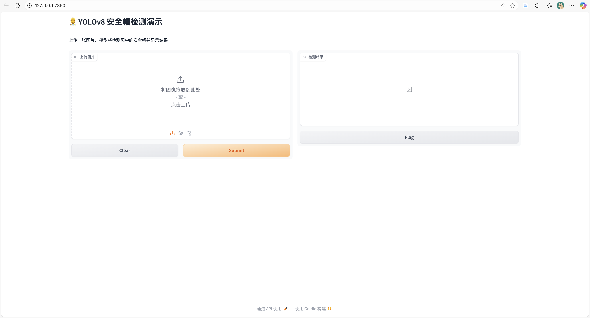
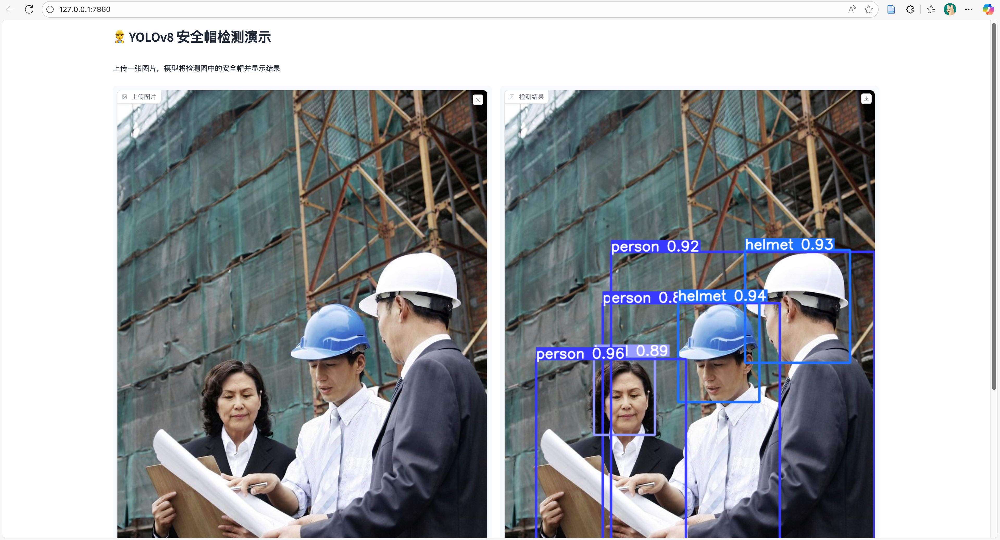
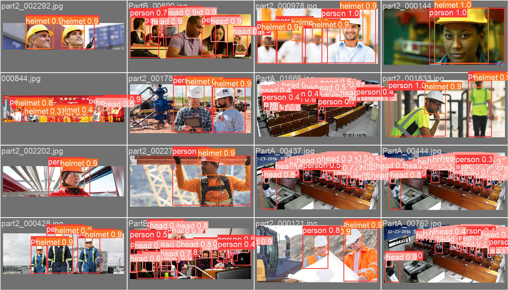
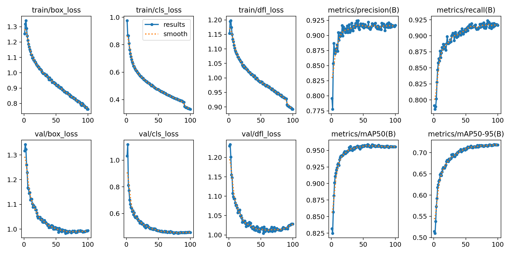

# YOLOv8 安全帽检测

基于 [YOLOv8](https://docs.ultralytics.com/zh/models/yolov8/#performance-metrics) 训练安全帽检测模型，数据集使用 [Safety-Helmet-Wearing-Dataset](https://github.com/njvisionpower/Safety-Helmet-Wearing-Dataset)

## 可视化界面
<p align="center">
  
  
</p>

## 检测效果

<p align="center">
  
</p>

## 指标
### 基于 YOLOv8l.pt 训练，`epoch = 100`
|Class|P|R|mAP0.5|mAP0.5:.95|
|---|---|---|---|---|
|all|0.9106|0.9048|0.9468|0.7088|
|person|0.8498|0.8855|0.9320|0.8367|
|head|0.9423|0.9201|0.9600|0.5256|
|helmet|0.9398|0.9089|0.9483|0.7641|

对应的**权重文件**：[百度云](https://pan.baidu.com/s/1BbQVPUCgxeaVppiqLBHq2g?pwd=6666)，提取码: `6666`


## Installation
配置虚拟环境
```shell script
git clone https://github.com/Xincheng-Tan/YOLOv8-Helmet-Detection.git
conda create -n helmet python=3.10
conda activate helmet
pip install -r requirements.txt
```

## Prepare dataset
如果对**文件存储路径**有修改，请根据自身情况同步修改**代码对应变量**

1. 下载开源数据集 [Safety-Helmet-Wearing-Dataset（SWHD）](https://github.com/njvisionpower/Safety-Helmet-Wearing-Dataset)至`./dataset/`
2. 执行`./check.suffix.py`，将`./data/VOC2028/JPEGImages/`路径下图片后缀名统一为`jpg`
3. 执行`./data/gen_data/gen_head_helmet.py`，将**VOC格式（.xml 后缀）的数据集转换成 Darknet格式（.txt 后缀）**、同时进行**数据集分割**
4. 原 SWHD 数据集只提供`person`（实际为`head`）和`hat`两类标签，如果需要检测`person`、`head`、`helmet`3个类别，则需要**增加对 `person` 的标注**
    1. 下载官方开源权重 [yolov8x.pt、 yolov8l.pt](https://docs.ultralytics.com/zh/models/yolov8/#performance-metrics) 到 `./weights/`
    2. 执行`./data/gen_data/gen_person.py`，使用 yolov8x.pt 对 SWHD 数据集进行检测，保存 `person` 类别的检测结果
    3. 执行`./data/gen_data/merge_data.py`，将`person`标签的标注信息合并到 SWHD 数据集

## Train/Eval
1. 检查文件结构，执行 `tree -d`：
```txt
./
|-- Safety_Helmet_Train_dataset
|   |-- images
|   |   |-- test
|   |   |-- train
|   |   `-- val
|   `-- labels
|       |-- test
|       |-- train
|       `-- val
|-- data
|   |-- gen_data
|   `-- person_detection
|       |-- test
|       |   `-- labels
|       |-- train
|       |   `-- labels
|       `-- val
|           `-- labels
|-- dataset
|   `-- VOC2028
|       |-- Annotations
|       |-- ImageSets
|       |   `-- Main
|       |-- JPEGImages
|       `-- Labels
`-- weights
```

2. **检查标注文件格式**。每个图片对应的标注文件（.txt 后缀）应该遵循如下规范：
    * 每一行都是一个目标
    * 类别序号从零索引开始编号
    * 每一行符合 `class x_center y_center width height` 格式
    * 坐标值归一化（0到1）

3. 创建训练配置文件 `my_data.yaml`：
```yaml
path: /root/autodl-fs/projects/helmet/Safety_Helmet_Train_dataset/

train: images/train
val: images/val
test: images/test

# number of classes
nc: 3

# class names
names: ['person', 'head', 'helmet']
```

4. 执行 `./train.py`，基于官方开源权重 [YOLOv8l.pt](https://docs.ultralytics.com/zh/models/yolov8/#performance-metrics) 进行微调训练。训练结果保存在 `./runs/yolov8l_custom/`
<p align="center">
  
</p>

5. 将 best.pt 复制到 `./weights/` 下，执行 `./test.py`，测试模型性能。测试结果保存在 `./runs/test/`

## Demo
使用 [gradio](https://www.gradio.app/) 构建
1. 在本地终端执行 `ssh -CNg -L 7860:127.0.0.1:7860 root@10.130.136.14 -p 45262`
    1. 如果在云服务器运行 demo 程序，在本地访问需要进行 **ssh 端口映射（如上）**，参考：[AutoDL 帮助文档](https://www.autodl.com/docs/ssh_proxy/#_3)
    2. 如果需要公网访问，请暴露 demo 程序监听的端口
2. 执行 `./demo.py`，访问 `127.0.0.1: 7860`
    1. 如果需要指定检测的类别，修改 `TARGET_CLASSES`。编号对应类别：`0 - person ; 1 - head ; 2 - helmet`

## Acknowledge
[YOLOv8](https://docs.ultralytics.com/zh/models/yolov8/#performance-metrics)
[Safety-Helmet-Wearing-Dataset](https://github.com/njvisionpower/Safety-Helmet-Wearing-Dataset)
[Smart_Construction](https://github.com/PeterH0323/Smart_Construction)
[gradio](https://www.gradio.app/)
